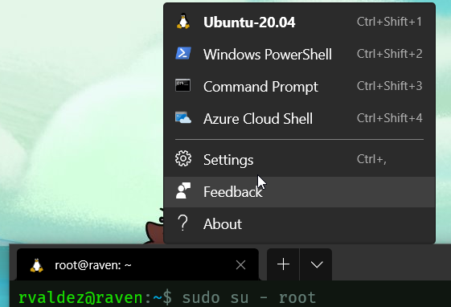
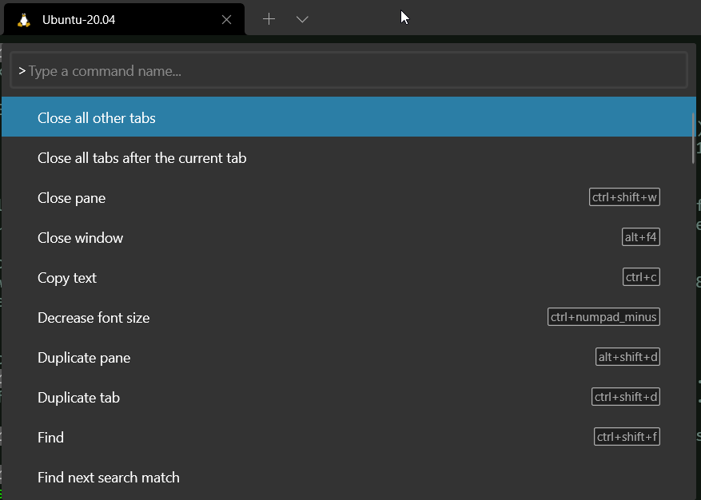

# An Introduction to Linux as a Development Environment

## Syllabus
- [An Introduction to Linux as a Development Environment](#an-introduction-to-linux-as-a-development-environment)
  - [Syllabus](#syllabus)
    - [Preliminaries](#preliminaries)
    - [Getting a Linux Environment](#getting-a-linux-environment)
    - [Logging into linux](#logging-into-linux)
    - [Using the command line](#using-the-command-line)
    - [An introduction to Docker (or Podman)](#an-introduction-to-docker-or-podman)
    - [An introduction to Ansible](#an-introduction-to-ansible)

### Preliminaries
1. What is Linux and kernels in general

   * [Unix](https://en.wikipedia.org/wiki/Unix)
   * [Linux](https://en.wikipedia.org/wiki/Linux)
   * [Kernels](https://en.wikipedia.org/wiki/Kernel_(operating_system))

2. Base programs and the GNU Project


   Beside the kernel, the base programs bundled with the Linux distributions are the GNU utils. Below are some of those programs belonging to the repo `coreutils`
   About [coreutils](https://github.com/coreutils/coreutils)
   ```
   The programs that can be built with this package are:

   arch b2sum base32 base64 basename basenc cat chcon chgrp chmod chown
   chroot cksum comm coreutils cp csplit cut date dd df dir dircolors dirname
   du echo env expand expr factor false fmt fold groups head hostid hostname
   id install join kill link ln logname ls md5sum mkdir mkfifo mknod mktemp
   mv nice nl nohup nproc numfmt od paste pathchk pinky pr printenv printf ptx
   pwd readlink realpath rm rmdir runcon seq sha1sum sha224sum sha256sum
   sha384sum sha512sum shred shuf sleep sort split stat stdbuf stty sum sync
   tac tail tee test timeout touch tr true truncate tsort tty uname unexpand
   uniq unlink uptime users vdir wc who whoami yes
   ```

   Programs like C and C++ compilers and the vi editor are also part of the GNU Projects


3. Free Software and Open Source Software
2. Linux Distributions
   1. Debian Based
   2. Red Hat
   3. Notable Distributions
      1. [Slackware](http://www.slackware.com)
      2. [Debian](https://www.debian.org)
      3. [Ubuntu](https://ubuntu.com)
      4. [Fedora](https://getfedora.org)
      5. [CentOS](https://www.centos.org)
      6. [Pop!_OS](https://pop.system76.com)
      7. [Arch](https://archlinux.org)
3. A quick note about hardware architectures
   1. X86 X64
   2. ARM
### Getting a Linux Environment
1. Windows and WSL

   To setup WSL on your Windows 10 machine, follow [this guide](https://docs.microsoft.com/en-us/windows/wsl/install-win10). I also consider the Microsoft Terminal ([project](https://github.com/Microsoft/Terminal), [setup guide](https://docs.microsoft.com/en-us/windows/terminal/get-started)) an integral part of the Linux on Windows experience. 
   
   Once installed, you can select one of the several terminal types
   


   Also, the shortcuts can be learned with the Command Palette with `Ctrl`-`Shift`-`P` 


2. Windows and Dual Boot
3. MacOs and BSD
4. Linux on bare metal
5. Virtual Machines
6. Linux on the cloud

### Logging into linux
1. The Linux Console
   
   The console consists of a (physical) screen and keyboard attached to the Linux server. There's no network involved in the access to the console


2. Command line sessions with SSH
   1. Interactive session
      The most common session with SSH is an interactive session, i. e. a session where you issue commands and the command interpreter communicates you back the results. To start an interactive session you should know (or have):
         * The dns name or IP address of the remote host
         * Your username
         * Your password or private key
      
      For example, to start an interactive session at my.server.mx as the centos user with a key id_ecdsa_centos_private_key you can use the command:
      `ssh -i id_ecdsa_centos_private_key centos@my.server.mx`
 
   2. Remote command execution
    
      SSH can take a command and a command line argument, for example, to show the file at the /etc/apache2/sites-enabled folder on the 3.45.67.28 server, with a user with the same name as the current one, you can type:
      `ssh 3.45.67.28 ls -lF /etc/apache2/sites-enabled`

   3. Port forwarding
   4. Tunneling
   5. Jump Hosts
   6. ssh dministrativia:
      1. The `.ssh` directory

         Each user has a $HOME/.ssh directory where ssh looks for the user configuration. For example files like authorized_keys, known_hosts, config and private keys can be there. The directory holds sensitive information so usually only has read, write and execute permissions for the owner

      2. authorized_keys
         Public keys stored here are used to check against private key held by a user. If they match, the user is granted access without the need of a password

      3. known_hosts

         For each new host that the user acceses, this file holds the fingerprint for the public key of the remote host. This file is checked every time you start a session at a known (previously accessed) IP or DNS name. If the fingerprint does not match, a warning is issued and the SSH refuses to connect

      4. ssh_keygen: key generation, key comments, deletion of know hosts
         
         To create a key: `ssh-keygen`
         
         To change the comment stored on the private and public key: `ssh-keygen -c -c "New comment on the private key" -f private_key file`

         To delete a known host from known_hosts: `ssh-keygen -R ip_or_dnsname`


3. File transfers with SSH
   
   The following methods use SSH as the underlying protocol, so, if you already have SSH access, you also have sftp and scp  
   1. sftp
   
   ftp is an interactive prompt to transfer files. The most commond commands are:

   * pwd - the current directory
   * dir - the contents of the current remote directory
   * get - downloads a file to the local machine
   * put - uploads a file to the remote machine


   sftp provi
   1. scp
   
   scp is specially useful for copying folder structures. This is done via a recursive copy: The general syntax for scp is `scp [-r] source target`
   `scp -R mywebapp ubuntu@remote.company.mx:/home/myuser`
   
   `scp ubuntu@remote.company.mx:/tmp/awscliv2.zip . `
4. Graphical User Interface
   1. Gnome
   2. KDE
   3. Xfce
   4. vnc and xrdp
   5. Apache Guacamole

### Using the command line
1. Multiplexing the session: `tmux`
2. Working with files
   1. Listing files
   2. Permissions and ACLs
   3. Special permissions: Set UID, Set GID
   4. Creating directories (folders)
   5. Current and parent directories
   6. Full and relative paths
3. Getting help
   1. The `man` command
   2. The `apropos` command
4. Finding things
   1. The `whereis` command
   2. The `find` command
5. Connecting commands
   1. stdin, stdout, stderr
   2. Redirecting stdout
   3. Redirecting stderr
   4. Redirecting stdin
   5. Connecting stdout to stdin
6. Editing files
   1. `nano`
   2. `vi`
7. Other useful commands
   1. `cut`
   2. `awk`
   3. `grep`
   4. `xargs`
8. An Introduction to `bash` Shell Scripting
   1. hash bang
   2. `echo`
   3. variables
   4. `if`
   5. `for`
   6. `while`
9. An Introduction to `awscli`
   1. credentials and profiles
   2. `s3`
   3. `ec2`
10. Network
   4.  `netstat`
   5.  `ss`
   6.  `ping`
   7.  `traceroute`
   8.  `nslookup`
   9.  `dig`
11. Web developemnt
    1.  `git`
    2.  `curl`
    3.  Publishing a site with Apache Web Server
    4.  What it takes to make a website use SSL
        1.  DNS
        2.  Lets Encrypt
12. Finding what is wrong
    1.  `/var/log`
    2.  `tail`
 

### An introduction to Docker (or Podman)

### An introduction to Ansible