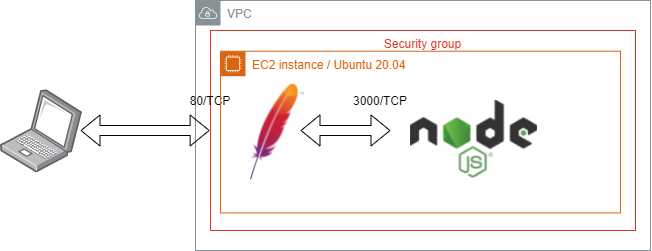

# Web Development

This is the documentation and command log for the setup of an inverse proxy webserver for the site `miguel.usuariolinux.org` (this name was made up) to server via HTTP the development website for the [Node API example](https://github.com/miguelhuchim05/user-api-demo) provided by Ing. Miguel Huchim.




## Installation of packages
Ubuntu allows for the installation of packages via the `apt` program. This requires elevated privileges so you have to precede the `apt` command with `sudo`

## Setup of the Apache Web Server
1. Update the package cache: `sudo apt update`
2. Search for the package apache2: `sudo apt search apache`
3. Install the package: `sudo apt install apache2`

## Default locations and websites for Apache
* The configuration is located in `/etc/apache2`
* The default website is located at `/var/www/html`
* The default owner and group for apache is `www-data`
* Logs are located in `/var/log/apache2`

## Setup of a basic website
* Create a new directory for the websites: `sudo mkdir /websites`
* Change the owner to ubuntu:www-data: `sudo chown -R ubuntu:www-data /websites`
* Change to /websites and clone a repo: `cd /websites;git clone https://github.com/miguelhuchim05/user-api-demo.git`
* Install the node package manager: `sudo apt install npm`
* Change into the new directory and install dependencies: `cd /websites/user-api-demo;npm install`
* Start the development webserver: `npm start dev`
```
ubuntu@ip-172-31-23-47:/websites/user-api-demo$ npm run dev

> user-api-demo@1.0.0 dev /websites/user-api-demo
> cross-env DEBUG=app:* nodemon index

[nodemon] 2.0.7
[nodemon] to restart at any time, enter `rs`
[nodemon] watching path(s): *.*
[nodemon] watching extensions: js,mjs,json
[nodemon] starting `node index index.js`
Listening at http://localhost:3000
```
This starts a development server in port 3000. Follow the readme in https://github.com/miguelhuchim05/user-api-demo to use the API.

## Setup of a reverse proxy
* Enable the proxy module: `sudo a2enmod proxy`
* Enable the http proxy module: `sudo a2enmod proxy_http`
* Restart apache to load the modules: `sudo systemctl restart apache2`
* Create a new config file `miguel.usuariolinux.org.conf` in `/etc/apache2/sites-available`:
```
ubuntu@ip-172-31-23-47:/etc/apache2/sites-available$ cat miguel.usuariolinux.org.conf
<VirtualHost *:80>
        ServerAdmin webmaster@localhost
        ServerName miguel.usuariolinux.org

        ErrorLog ${APACHE_LOG_DIR}/miguel.usuariolinux.org.error.log
        CustomLog ${APACHE_LOG_DIR}/miguel.usuariolinux.org.access.log combined
        ProxyPass / http://127.0.0.1:3000/
        ProxyPassReverse / http://127.0.0.1:3000/

</VirtualHost>
```
* Check the config: `sudo apachectl -t`
* Enable the new site: `a2ensite miguel.usuariolinux.org`
* Reload the apache server: `sudo systemctl reload apache2`
* Edit the hosts file (if you don't have a real dns name) to fake the name resolution: 
```
ubuntu@ip-172-31-23-47:/etc/apache2/sites-available$ grep miguel /etc/hosts
127.0.0.1 localhost miguel.usuariolinux.org
```
* Test the access:
```
ubuntu@ip-172-31-23-47:~$ curl miguel.usuariolinux.org/api/user
{"data":[{"email":"demo@gmail.com","first_name":"juan","last_name":"perez","company":"Codemid","id":1}]}
```


